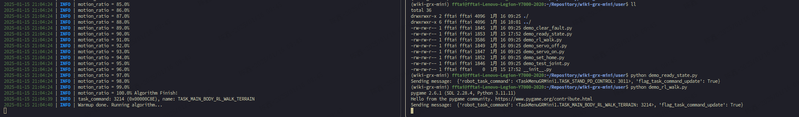
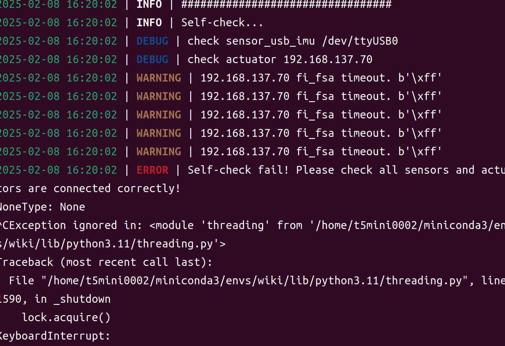

# Fourier-GRX GRMini 开发接口说明

## 机器人系统

Fourier-GRX GRMini 机器人的控制系统运行在一台主控电脑上，主控电脑系统为 Ubuntu 22.04 LTS。

### 登录系统

#### 本地登录

连接机器人控制电脑的 HDMI 显示器和 USB 键盘鼠标，开机后会自动进入系统桌面。

用户名为 `gr2m25jaxxxx`, `xxxx` 为机器人的后四位序列号，密码为 `fftai2015`。

#### 远程登录

机器人开机后，系统会自动启动机器人主控系统的热点信号，用户可以通过手机或电脑连接机器人的热点信号。

- 热点名称为 `gr2m25jaxxxx`, `xxxx` 为机器人的后四位序列号。
- 热点密码为 `66668888`。

连接完成后，可以通过 `ssh` 服务登录到机器人的主控电脑，登录用户名为 `机器人热点信号名称`，密码为 `fftai2015`。

> **说明**：
> 部分机器人没有配置自动热点模式，因此搜不到热点信号，此时可以考虑用有线网络方式连接机器人。
> 机器人的有线网口 IP 地址为 `192.168.137.220`, ssh 登录信息与无线方式相同。

### 程序启动

机器人提供了 `fourier-grx start` 命令用于机器人控制程序启动。

```bash
# 在机器人主控电脑上：
# 1. 准备好手柄，连接到机器人主控电脑的 USB 端口。
# 2. 启动 fourier-grx 主程序
fourier-grx start
```

程序启动完成后，即可使用手柄控制机器人完成相应的任务。（图片为 XBOX 键位手柄，具体按键功能对应关系与所用手柄种类相关）


### 二次开发

#### 二次开发环境支持

| 系统环境             | Python 环境   | 已测试 | 测试通过 |
|------------------|-------------|-----|------|
| Ubuntu 22.04 LTS | Python 3.11 | ✅   | ✅    |
| Windows          | Python 3.11 |     |      |
| MacOS            | Python 3.11 |     |      |

#### 开发环境搭建

机器人提供了 `fourier-grx setup_conda` 命令用于一键配置 conda 开发环境。

```bash
# 在机器人主控电脑上：
fourier-grx setup_conda

# 程序运行完成后，会搭建出一个名为 `fourier-grx` 的 conda 环境，可以通过以下命令激活该环境
conda activate fourier-grx

# 如果希望自主搭建开发环境，可以在 $HOME/fourier-grx/whl 中找到依赖库文件进行手动安装。
```

#### 同步示例程序

可以通过 git 同步机器人的二次开发接口示例程序，同步命令为：

```bash
git clone https://gitee.com/FourierIntelligence/wiki-grx-mini
```

建议同步到 `$HOME` 目录下，同步完成后，可以通过 `cd $HOME/wiki-grx-mini` 进入该目录查看。

---

## Fourier-GRX 开发接口

开发接口分为两类：

- 针对高层应用的接口 **user**
- 针对底层开发的接口 **developer**

两者的区别在于：

- **user** 接口是在启动了 fourier-grx 主程序后，通过 zenoh (https://zenoh.io/) 接口进行通信，发送指令数据并返回状态信息，主要用于用户对机器人进行高层控制。
- **developer** 接口是直接调用 fourier-grx 底层二次开发接口，可以直接获取到底层的状态信息，用于开发者对机器人进行底层开发。

### user

user 目录下的接口是为了方便用户使用 Fourier-GRX 而设计的接口，
这些接口更多是对 Fourier-GRX 系列机器人内部已有算法的调用。

> **说明**：
> user 接口的开发使用了 zenoh 进行通信，因此可以在任意一台与机器人同一局域网的电脑上进行开发。

目前提供的开发示例有：

- `demo_servo_on`: 机器人全关节上电使能。
- `demo_servo_off`: 机器人全关节下电失能。
- `demo_clear_fault`: 清除机器人全关节报警。当机器人出现报警时，可以通过此接口清除报警。
- `demo_set_home`: 设置机器人全关节零位位置为当前位置，用于标定机器人关节零位。
- `demo_test_joint`: 机器人关节运动功能测试，用于检测机器人关节是否能够正常运动。
- `demo_ready_state`: 机器人运行到 **准备状态**，为微曲膝关节的站立姿态。
- `demo_rl_walk`: 机器人运动到 **行走状态**，可以用手柄控制机器人行走。

#### 示例程序运行方法

```bash
# 在机器人主控电脑上
# 1. 启动 fourier-grx 主程序
conda activate fourier-grx  # 激活 conda 环境
python $HOME/fourier-grx/whl/run.py --config=$HOME/fourier-grx/config/grmini1/config_GRMini1_{具体机型}_sdk.yaml  # 启动 fourier-grx 主程序

# 在机器人主控电脑上或与机器人同局域网内的任意一台电脑上
# 2. 启动 user 接口示例
conda activate fourier-grx  # 激活 conda 环境
python $HOME/wiki-grx-mini/user/demo_{具体示例}.py  # 启动示例
```

如果是在远程电脑上控制机器人，建议使用 Terminal 开多窗口，方便查看机器人状态信息，确保任务有正确被执行。
如下图所示：



### developer

developer 目录下的接口是为了方便开发者对 Fourier-GRX 系列机器人进行底层开发而设计的接口，
这些接口更多是对 Fourier-GRX 系列机器人内部底层硬件的调用。

> **说明**：
> 目前为了保证接口的数据有效性和数据传输的实时性，developer 接口的开发需要在机器人的主控电脑上完成。
> 因此，建议开发者在对机器人足够熟悉后再使用该接口进行开发。

目前提供的开发示例有：

- `demo_print_state`: 打印机器人状态信息。
- `demo_servo_on`: 机器人全关节上电使能。
- `demo_servo_off`: 机器人全关节下电失能。
- `demo_set_home`: 设置机器人全关节零位位置为当前位置，用于标定机器人关节零位。
- `demo_set_pid`: 设置机器人关节 PID 参数。
- `demo_ready_state`: 机器人运行到 **准备状态**，为微曲膝关节的站立姿态。
- `demo_rl_walk`: 机器人运动到 **行走状态**，可以用手柄控制机器人行走。

#### 示例程序运行方法

```bash
# 在机器人主控电脑上
# 1. 启动 developer 接口示例
conda activate fourier-grx  # 激活 conda 环境
python $HOME/wiki-grx-mini/developer/demo_{具体示例}.py --config=$HOME/fourier-grx/config/grmini1/config_GRMini1_{具体机型}_sdk.yaml  # 启动示例
```

---

## Fourier-GRX 接口协议 [user 接口]

Fourier-GRX user 接口使用 zenoh 进行通信，zenoh 是一个分布式系统的数据共享和协作平台 (https://zenoh.io/)。

针对机器人开发，Fourier-GRX 提供了以下接口 key：

- `fourier-grx/dynalink_interface/task/server`
    - 用于接收任务指令，主要用于获取机器人当前的任务模式
- `fourier-grx/dynalink_interface/grx/server`
    - 用于接收 GRX 机器人更细节的状态信息
- `fourier-grx/dynalink_interface/task/client`
    - 用于发送任务指令给机器人，主要用于切换不同的任务模式
- `fourier-grx/dynalink_interface/grx/client`
    - 用于进行 GRX 机器人不同任务更细节的控制参数设置。
    - 例如：设置机器人的行走指令参数等。

### task/server 接口协议 (用户接收)

key 说明列表：

| key                    | 说明       | 数据类型 | 具体描述                                                                                             |
|------------------------|----------|------|--------------------------------------------------------------------------------------------------|
| `flag_task_in_process` | 任务是否在进行中 | bool | 0: 任务未开始或已结束，1: 任务进行中                                                                            |
| `robot_task_state`     | 机器人任务状态  | int  | 当前机器人任务状态，如果设置了 task/client 中的 `flag_task_command_update` 为 True，会更新此值，更新值为 `robot_task_command` |
| `robot_task_substate`  | 机器人任务子状态 | int  |                                                                                                  |

### grx/server 接口协议 (用户接收)

key 说明列表：

| key                        | 说明       | 数据类型 | 具体描述                      |
|----------------------------|----------|------|---------------------------|
| `robot_error_codes`        | 机器人错误码   | int  | 机器人错误码，0: 无错误，其他: 具体错误码   |
| `robot_battery_percentage` | 机器人电量百分比 | int  | 机器人电量百分比，0-100            |
| `robot_charging_level`     | 机器人电量等级  | int  | 1为低电量红色 2为中等电量黄色 3为较多电量绿色 |
| `robot_charging_state`     | 机器人充电状态  | int  | 0: 未充电，1: 正在充电            |

### task/client 接口协议 (用户发送)

key 说明列表：

| key                        | 说明         | 数据类型 | 具体描述            |
|----------------------------|------------|------|-----------------|
| `flag_task_command_update` | 任务指令请求更新标志 | bool | 0: 不更新，1: 更新    |
| `robot_task_command`       | 任务指令       | int  | 机器人任务指令，具体指令见下表 |

机器人任务指令列表：

- 任务指令通过 fourier_grx.TaskCommand 枚举类定义，具体定义如下：
- 具体任务值可能会根据机器人的不同，或 `fourier-grx` 版本的不同而有所变化，具体值以实际为准。

| 任务指令             | 任务值  | 任务描述                            |
|------------------|------|---------------------------------|
| TASK_SERVO_OFF   | 36   | 机器人全关节下电失能                      |
| TASK_SERVO_ON    | 35   | 机器人全关节上电使能                      |
| TASK_CLEAR_FAULT | 34   | 清除机器人全关节报警                      |
| TASK_SET_HOME    | 3000 | 设置机器人全关节零位位置为当前位置               |
| TASK_TEST_JOINT  | 3003 | 机器人关节运动功能测试，用于检测机器人关节是否能够正常运动   |
| TASK_READY_STATE | 3011 | 机器人运行到 **准备状态**，为微曲膝关节的站立姿态     |
| TASK_RL_WALK     | 3530 | 机器人运动到 **行走状态**，可以用手柄控制机器人行走    |
| TASK_RL_WALK_RUN | 3542 | 机器人运动到 **跑步状态**，可以用手柄控制机器人行走/跑步 |

### grx/client 接口协议 (用户发送)

key 说明列表：

- 为规范用户的高层控制指令传入，对输入参数进行了封装和抽象。
  主要定义了 “虚拟摇杆 (virtual joystick)” 和 “虚拟遥操作手柄 (virtual teleoperation)” 的概念来进行机器人的控制。
- 在需要使用到对应虚拟设备时，需要在主程序启动时调用的 `config_xxx.yaml` 文件中
  设置 `peripheral/use_virtual_joystick` 或 `peripheral/use_virtual_teleoperation` 为 True。

| key                                       | 说明             | 数据类型                                               | 具体描述             |
|-------------------------------------------|----------------|----------------------------------------------------|------------------|
| `virtual_joystick_button_up`              | 虚拟手柄上按钮状态      | int                                                | 0: 未按下，1: 按下     |
| `virtual_joystick_button_down`            | 虚拟手柄下按钮状态      | int                                                | 0: 未按下，1: 按下     |
| `virtual_joystick_button_left`            | 虚拟手柄左按钮状态      | int                                                | 0: 未按下，1: 按下     |
| `virtual_joystick_button_right`           | 虚拟手柄右按钮状态      | int                                                | 0: 未按下，1: 按下     |
| `virtual_joystick_button_l1`              | 虚拟手柄 L1 按钮状态   | int                                                | 0: 未按下，1: 按下     |
| `virtual_joystick_button_l2`              | 虚拟手柄 L2 按钮状态   | int                                                | 0: 未按下，1: 按下     |
| `virtual_joystick_button_r1`              | 虚拟手柄 R1 按钮状态   | int                                                | 0: 未按下，1: 按下     |
| `virtual_joystick_button_r2`              | 虚拟手柄 R2 按钮状态   | int                                                | 0: 未按下，1: 按下     |
| `virtual_joystick_axis_left`              | 虚拟手柄左摇杆状态      | array(int, int)                                    | 摇杆状态值范围为 [-1, 1] |
| `virtual_joystick_axis_right`             | 虚拟手柄右摇杆状态      | array(int, int)                                    | 摇杆状态值范围为 [-1, 1] |
| ==========                                | ==========     | ==========                                         | ==========       |
| `virtual_teleoperation_left_handle_pose`  | 虚拟遥操作手柄左手柄姿态   | array(float, float, float,float,float,float,float) |                  |
| `virtual_teleoperation_right_handle_pose` | 虚拟遥操作手柄右手柄姿态   | array(float, float, float,float,float,float,float) |                  |
| `virtual_teleoperation_button_left`       | 虚拟遥操作手柄左手柄按钮状态 | int                                                | 0: 未按下，1: 按下     |
| `virtual_teleoperation_button_right`      | 虚拟遥操作手柄右手柄按钮状态 | int                                                | 0: 未按下，1: 按下     |

## Fourier-GRX 接口协议 [developer 接口]

### 状态字典（state dict）

Fourier-GRX developer 接口使用状态字典（state dict）返回机器人当前的状态信息，状态字典的 key 和 value 如下：

| key                    | 说明               | 数据类型                           |
|------------------------|------------------|--------------------------------|
| `imu_quat`             | 机器人 IMU 的四元数姿态信息 | array(float,float,float,float) |
| `imu_euler_angle`      | 机器人 IMU 的欧拉角姿态信息 | array(float, float, float)     |
| `imu_angular_velocity` | 机器人 IMU 的角速度信息   | array(float, float, float)     |
| `imu_acceleration`     | 机器人 IMU 的线加速度信息  | array(float, float, float)     |
| `joint_position`       | 机器人关节的位置信息       | array(float * num_of_joints)   |
| `joint_velocity`       | 机器人关节的速度信息       | array(float * num_of_joints)   |
| `joint_kinetic`        | 机器人关节的力矩信息       | array(float * num_of_joints)   |

### 控制字典（control dict）

Fourier-GRX developer 接口使用控制字典（control dict）发送机器人的控制指令，控制字典的 key 和 value 如下：

| key                   | 说明                | 数据类型                         | 具体描述                                             |
|-----------------------|-------------------|------------------------------|--------------------------------------------------|
| `control_mode`        | 机器人的控制模式          | int (float * num_of_joints)  | 0: 无控制，1: 电流控制，2: 力矩控制，3: 速度控制，4: 位置控制, 6: PD 控制 |
| `position`            | 机器人关节的位置指令        | array(float * num_of_joints) | 单位: deg                                          |
| `velocity`            | 机器人关节的速度指令        | array(float * num_of_joints) | 单位: deg/s                                        |
| `effort`              | 机器人关节的力矩指令        | array(float * num_of_joints) | 单位: Nm                                           |
| `current`             | 机器人关节的电流指令        | array(float * num_of_joints) | 单位: A                                            |
| `position_control_kp` | 机器人关节位置控制的 P 系数   | array(float * num_of_joints) |                                                  |
| `velocity_control_kp` | 机器人关节速度控制的 P 系数   | array(float * num_of_joints) |                                                  |
| `velocity_control_ki` | 机器人关节速度控制的 I 系数   | array(float * num_of_joints) |                                                  |
| `pd_control_kp`       | 机器人关节 PD 控制的 P 系数 | array(float * num_of_joints) |                                                  |
| `pd_control_kd`       | 机器人关节 PD 控制的 D 系数 | array(float * num_of_joints) |                                                  |

---

## 常见问题

- 机器人 self-check 失败，提示无法访问指定 ip 的执行器：
    - 
    - 检查机器人的执行器是否上电，是否闪烁紫色呼吸灯。
    - 检查机器人的有线网口是否连接到有线网络，并且系统已正确配置为静态 IP 模式。
    - 检查机器人是否存在线路连线问题。
- 如何让机器人访问外网？
    - 由于机器人的 wifi 模块已被配置为自动热点模式，因此无法使用机器人连接外部 wifi 网络。
      如果需要使用外部网络，可以将机器人的有线网口连接到外部网络，然后通过有线网口访问外网。
      访问外网前需要将机器人的有线网口设置为 **动态 IP 模式（DHCP 模式）**。
      访问完成后，需要将有线网口设置为 **静态 IP 模式**，并设置 IP 地址为 `192.168.137.200`, 子网掩码为 `255.255.255.0`。
      并重启机器人的有线网络服务，或者重启机器人主控电脑。
- 如何关闭机器人的 wifi 热点自启动？让 wifi 恢复正常的手动连接模式？
    - 机器人的 wifi 热点自启动由服务 rocs-wifi 自动启动，可以通过以下命令关闭 rocs-wifi 服务：
    ```bash
    sudo systemctl stop rocs-wifi  # 只关闭一次
    sudo systemctl disable rocs-wifi  # 永久关闭
    ```
- 机器人的控制频率是多少？
    - 使用 **user** 接口时，机器人的主程序控制频率默认为 **50Hz**。状态输出发送以及外部指令接收的频率也为 **50Hz**。
    - 使用 **developer** 接口时，机器人底层的数据更新频率默认为 **400Hz** （最高支持 **500Hz**），具体算法运行频率由用户自行控制，但建议不超过
      **500Hz**。
- 机器人程序报 **Timeout** 警告 ⚠️ 怎么办？
    - 检查机器人的主控电脑是否有设置 ipv6 启动，如果有，建议关闭 ipv6。
    - 检查机器人所在的有线局域网是否有其他电脑接入并开启了 ipv6，如果有，建议关闭 ipv6。
    - 如果仍然偶发该警报，建议检查对应丢包执行器的上下连接线是否接触良好，是否有松动。
- user 测试程序跑不通，机器人控制程序没有提示收到指令信息？
    - 目前 zenoh 数据发送会优先有线端口发出。
    - 如果是使用外部电脑开发机器人，同时连接了外部电脑的有线接口和机器人的无线热点信号，可能导致数据发送失败。
- ImportError: /lib/x86_64-linux-gnu/libc.so.6: version `GLIBC_2.33' not found
    - (required by
      /home/gr225ja0023/miniconda3/envs/fourier-grx/lib/python3.11/site-packages/fourier_grx.cpython-311-x86_64-linux-gnu.so)
    - 安装编译工具，`sudo apt install build-essentials`
    - 如果仍然报错，建议升级系统到 Ubuntu 22.04 LTS，或者使用 Ubuntu 22.04 LTS 系统的开发主机。

---

## 更新日志

- 2025-03-04:
    - 升级 zenoh 版本到 1.0.1
    - 使用的 rl_walk 指令改为 3530 (请确保机器人主程序已更新到版本 >= 2.2.5)
- 2025-03-24:
    - 升级 fourier-grx >= 2.3.0 程序，旧程序存在兼容性问题，适配新版本程序接口

---

## 感谢

- Zenoh 团队提供的 zenoh 分布式系统的数据共享和协作平台。https://zenoh.io/